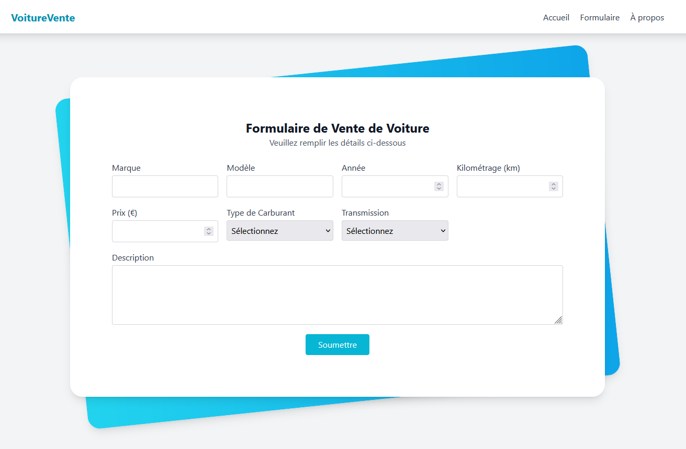

# 📱 Tailwind

**une page HTML stylisée avec Tailwind CSS**

## 🔍 Aperçu

Tout en respectant l’esthétique de la capture fournie (centré, carte blanche, bord arrondi, ombre, responsive, etc.)
Cliquez sur **"stylisée avec Tailwind"** 

| page HTML stylisée avec Tailwind CSS |
|----------------------------------------------------|
|  |
## 📝 Licence

Ce projet est sous licence **MIT**.
